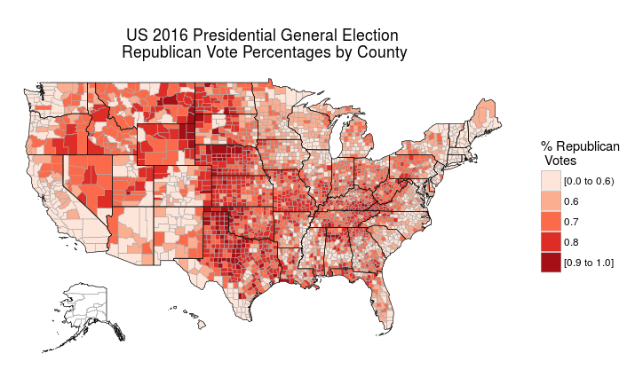

# Presidential General Elections 2000 through 2016 

To get the transformed data and scripts
```bash
git clone https://github.com/stoneyv/presidential_general_elections.git
```

* Transformed data for 2000 through 2016 is in the output folder.
* Transformed data uses USGS for 2004, 2008,and 2012. 
* Transformed data uses Federal Elections Project for 2000.
* The source of original data is cited.
* Original USGS and Federal Elections Project data is in the data/ folder.
* The transformation of data may be replicated using the jupyter ipython notebooks.
* Alaskan data is not satisfactory. Resolving boroughs from precinct/district data.
* The scripts folder contains R based code that produces plots.
* The images folder contains plots that were produced with the scripts or notebooks.

---

## Plots

| Year | % Votes by county | % Dem Votes by County | % Rep Votes by County |
| --- | --- | --- | --- |
| 2016 |  |  |  |
| 2012 |  |  |  |
| 2008 |  | | |
| 2004 |  | | |
| 2000 |  | | |

___

## Data Sources 

### Tony McGovern 2016 Presidential General Election (unofficial results)
NOTE: Alaska vote entries for 2016 are currently repeated state totals. This will be resolved soon.  Also, Each secretary of state has a different date for official certification of elections which occurs before the electoral college vote in December.
* https://github.com/tonmcg/County_Level_Election_Results_12-16
* http://townhall.com/election/2016/president/
* https://www.elections.alaska.gov/index.php

### USGS 2012 Presidential General Election
County Results
https://catalog.data.gov/dataset/presidential-general-election-results-2012-direct-download

### USGS 2008 Presidential General Election
County Results
https://catalog.data.gov/dataset/2008-presidential-general-election-county-results-direct-download

### USGS 2004 Presidential General Election  
https://catalog.data.gov/dataset/2004-presidential-general-election-county-results-direct-download  

### David Lublin and D. Stephen Voss. 2001. "Federal Elections Project." American University, Washington, DC and the University of Kentucky, Lexington, KY.
### 2000 Election Data By State
http://www.american.edu/spa/ccps/Data-Sets.cfm  

### Census 2010 FIPS
https://www.census.gov/geo/reference/codes/cou.html
http://www2.census.gov/geo/docs/reference/codes/files/national_county.txt

### Census 2015,2013,2010,2000 shapefiles 
https://www.census.gov/geo/maps-data/data/cbf/cbf_counties.html  

___

## Other Potential Data Sources

### The Guardian, Full US 2012 election county-level results
https://www.theguardian.com/news/datablog/2012/nov/07/us-2012-election-county-results-download
https://fusiontables.google.com/DataSource?docid=1qcQLqrAIAe3RcEfdWSm_QcXMLmteVg4uSpSs1rM#rows:id=1

### The Guardian, 2008 presidential election results by state and county
https://www.theguardian.com/news/datablog/2009/mar/02/us-elections-2008
https://docs.google.com/spreadsheets/d/1gLzjUFBk9gtAPfZ-bNZVfFC1zNhGkY_WI_VD_OXHUYI/edit#gid=0

### Daily Kos presidential election results by congressional district
https://docs.google.com/spreadsheets/d/1VfkHtzBTP5gf4jAu8tcVQgsBJ1IDvXEHjuMqYlOgYbA/edit#gid=0  
https://docs.google.com/spreadsheets/d/146z3cDVx5WGCprbKGFSMeGfyTFfIlE8SbjrLQ0sfkBI/edit#gid=0  

### history.house.gov Election Statistics, 1920 to Present
http://history.house.gov/Institution/Election-Statistics/Election-Statistics/

### Harvard Election Data Archive
http://projects.iq.harvard.edu/eda/pages/about

### Open Elections
http://openelections.net/
https://github.com/openelections

### Library of Congress, US Election Statistics
https://www.loc.gov/rr/program/bib/elections/statistics.html

### electproject, Voter Turnout
http://www.electproject.org/home/voter-turnout/voter-turnout-data
http://www.electproject.org/2016g
https://docs.google.com/spreadsheets/d/1VAcF0eJ06y_8T4o2gvIL4YcyQy8pxb1zYkgXF76Uu1s/edit#gid=2030096602

### Census voter demographics by region 2004,2008,2012,2014
2014  
http://www.census.gov/data/tables/time-series/demo/voting-and-registration/p20-577.html  
2012  
http://www.census.gov/data/tables/2012/demo/voting-and-registration/p20-568.html  
2008 pdf  
http://www.census.gov/prod/2010pubs/p20-562.pdf   
2004 pdf  
http://www.census.gov/prod/2006pubs/p20-556.pdf  

### Voter Registration Statistics
Michigan 1998 through 2014  
http://www.michigan.gov/sos/0,8611,7-127-1633_8722---,00.html  
Pennsylvania 1995 through 2015, missing 2011  
http://www.dos.pa.gov/VotingElections/OtherServicesEvents/VotingElectionStatistics/Pages/Annual-Reports-on-Voter-Registration.aspx  
Wisconsin 2008 through 2015  
http://elections.wi.gov/elections-voting/statistics  

### Princeton 2016 Election Polling data  
http://election.princeton.edu/code/data/  

### The American Presidency Project
no election county/precinct results, polling and other  
http://www.presidency.ucsb.edu/index.php
